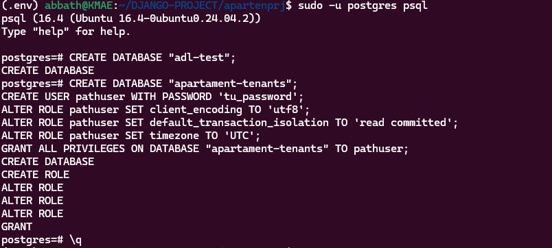
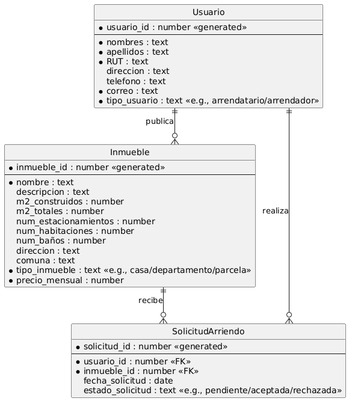
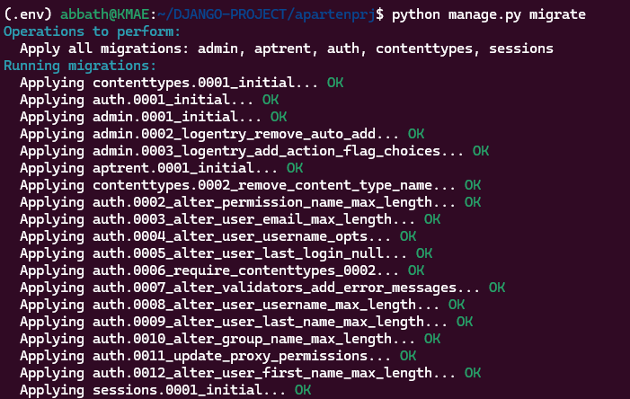
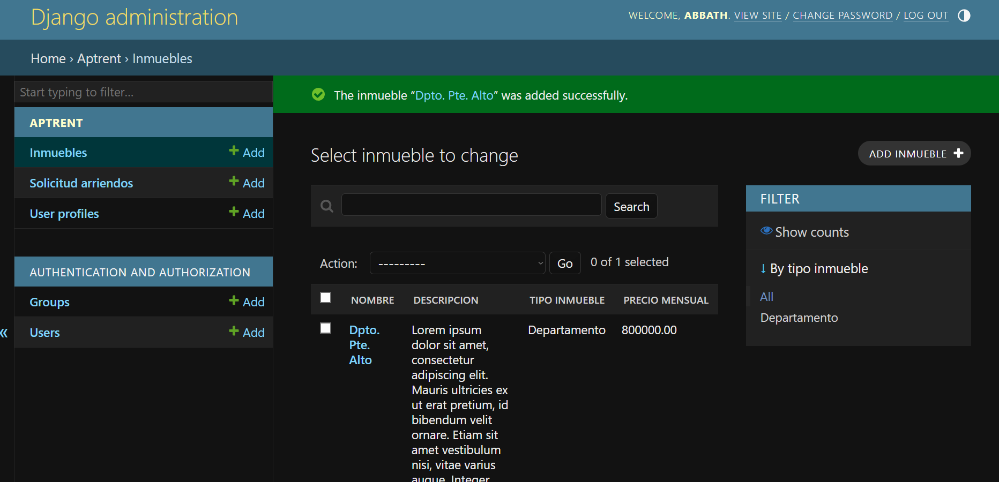
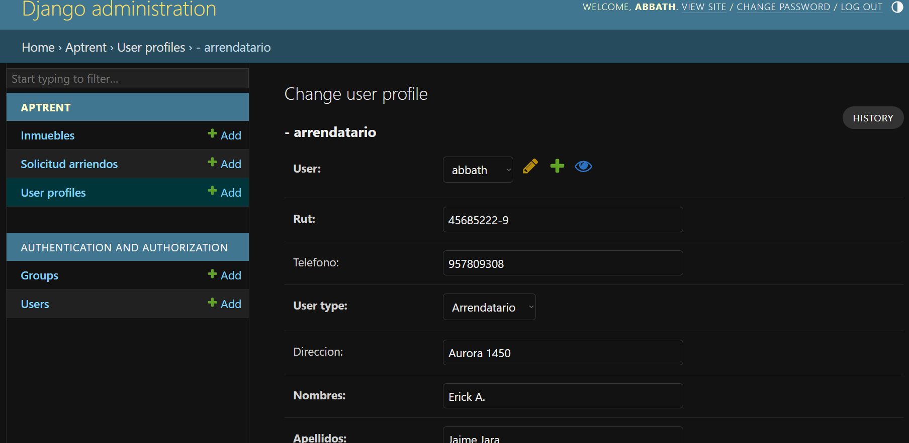
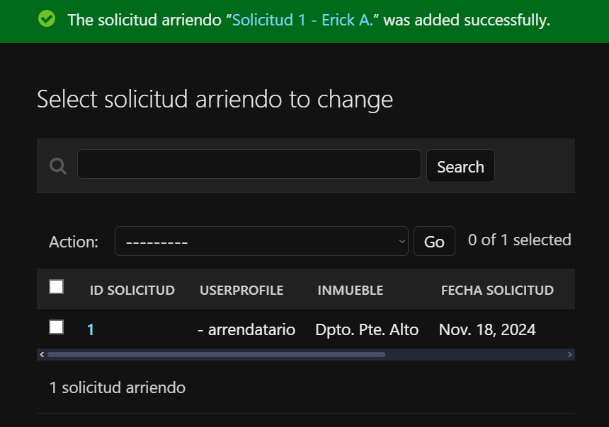

# Proyecto de Hito 1: Plataforma de Arrendamiento Inmobiliario

## Descripción

Este proyecto corresponde al Hito 1 del desafío de la plataforma de arrendamiento inmobiliario. El objetivo es integrar el modelo `UserProfile` con el modelo `User` de Django para gestionar arrendatarios y arrendadores. Actualmente, la funcionalidad está implementada en el panel de administración de Django, donde los usuarios pueden ser gestionados y vinculados a su perfil.

## Requerimientos

- Django 5.1.3
- Python 3.12+
- PostgreSQL

## Estructura de Modelos

### Modelo `Inmueble`
Define las propiedades de los inmuebles disponibles para arriendo. Incluye atributos como nombre, descripción, tamaño, estacionamientos, habitaciones, baños, entre otros.

### Modelo `UserProfile`
Este modelo extiende la funcionalidad del modelo `User` de Django, añadiendo atributos como `rut`, `telefono`, `user_type` (para diferenciar entre arrendatarios y arrendadores), y dirección. Se utiliza una relación de uno a uno con el modelo `User` para vincular ambos perfiles.

### Modelo `SolicitudArriendo`
Gestiona las solicitudes de arriendo realizadas por los usuarios, con atributos como fecha de solicitud, estado de la solicitud (pendiente, aceptada, rechazada), y una relación con el modelo `Inmueble` y `UserProfile`.

## Funcionalidad en el Panel de Admin

1. **Gestión de Inmuebles**: Permite agregar, editar y eliminar inmuebles disponibles para arriendo.
2. **Gestión de Perfiles de Usuario**: Los perfiles de usuario son creados automáticamente cuando se crea un usuario de Django y pueden ser gestionados desde el panel de administración.
3. **Solicitudes de Arriendo**: Los administradores pueden visualizar, aceptar o rechazar solicitudes de arriendo asociadas a los inmuebles y usuarios.

## Pasos para la Instalación

1. **Clonar el Repositorio**:
   ```bash
   git clone <repositorio-url>
   cd <repositorio>

2. **Configuración de la Base de Datos**:

    - Crea la base de datos en PostgreSQL.
    - Configura DATABASES en settings.py.

3. **Migraciones**: 
    Ejecuta las migraciones para crear las tablas en la base de datos:

        ```bash
        python manage.py migrate

4. **Crear un Superusuario**: 
    Para acceder al panel de administración:

    ```bash
    python manage.py createsuperuser

5. **Iniciar el Servidor**: 
    Ejecuta el servidor de desarrollo de Django:

    ```bash
    python manage.py runserver

6. **Acceder al Panel de Admin**: 
    Visita http://127.0.0.1:8000/admin para gestionar los modelos de Inmueble, UserProfile y SolicitudArriendo.

7. **Resultados Esperados**














Autor
Nombre: [Erick-Jaime-Jara]
Correo: [alucard.erick.mega@gmail.com]